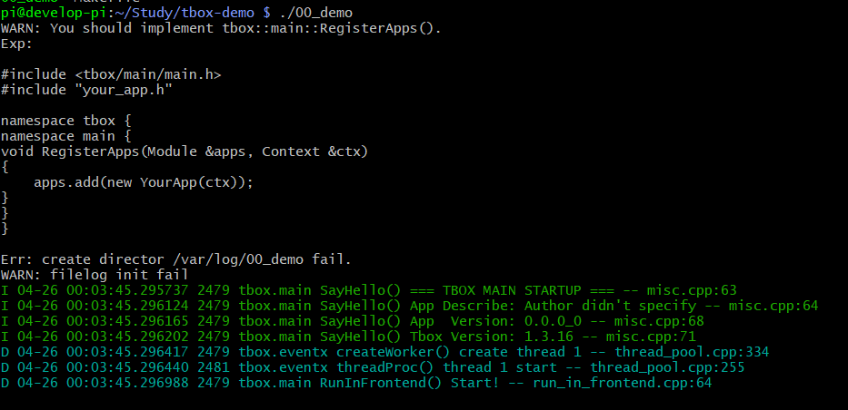

# cpp-tbox

# 简介
cpp-tbox，全称: C++ Treasure Box，是C++开发百宝箱，是基于事件的服务型应用开发库以及开发框架。

# 适用环境

- Linux 环境，主要是针对服务型应用的；
- C++11 以上。

# 快速上手

**准备**

`apt install -y g++ git make libgtest-dev libgmock-dev libmosquitto-dev`

**下载**

`git clone https://gitee.com/cpp-master/cpp-tbox.git`

**构建**

```
cd cpp-tbox;
STAGING_DIR=$HOME/.tbox make 3rd-party modules RELEASE=1
```
头文件与库文件都在 $HOME/.tbox 中。

**编写Demo程序**

创建自己的工程目录，然后在其中创建 demo.cpp 与 Makefile。

demo.cpp
```
#include <tbox/base/log.h>
#include <tbox/main/module.h>

using namespace std;

class Demo : public tbox::main::Module {
  public:
    Demo(tbox::main::Context &ctx) : tbox::main::Module("demo", ctx) { }
    virtual bool onInit(const tbox::Json &js) override { LogTag(); return true; }
    virtual bool onStart() override { LogTag(); return true; }
    virtual void onStop() override { LogTag(); }
    virtual void onCleanup() override { LogTag(); }
};

namespace tbox {
namespace main {

void RegisterApps(Module &app, Context &ctx) {  app.add(new Demo(ctx)); }

}
}

Makefile
```
TARGET:=demo
OBJECTS:=demo.o

CXXFLAGS:=-I$(HOME)/.tbox/include -DLOG_MODULE_ID='"demo"'
LDFLAGS:=-L$(HOME)/.tbox/lib -rdynamic
LIBS:=-ltbox_main -ltbox_terminal -ltbox_network -ltbox_eventx -ltbox_event -ltbox_log -ltbox_util -ltbox_base -lpthread -ldl

all : $(TARGET)

$(TARGET) : $(OBJECTS)
        g++ -o $@ $^ $(LDFLAGS) $(LIBS)
```

然后 make，然后执行 demo：


# 模块介绍

- base，基础库，含日志打印、常用工具等；
- util，工具库，在业务代码中可能会用到的库；
- event，事件库，实现Fd,Timer,Signal三种事件驱动；
- log，日志输出库，实现了终端、syslog、文件形式的日志输出；
- eventx，事件扩展库，含 ThreadPool 线程池模块，专用于处理阻塞性事务；TimerPool 定时器池模块；
- network，网络库，实现了串口、终端、UDP、TCP 通信模块；
- http，HTTP库，在network的基础上实现了HTTP的Server与Client模块；
- coroutine，协程库，众所周知，异步框架不方便处理顺序性业务，协程弥补之；
- mqtt，MQTT客户端库；
- terminal, 终端，类似shell的命令终端，可实现运行时与程序进行命令交互；
- main，应用程序框架，实现了完备的程序启动流程与框架，让开发者只需关心业务代码；
- alarm，闹钟模块，实现了4种常用的闹钟：CRON闹钟、单次闹钟、星期循环闹钟、工作日闹钟；
- flow，流程模块，含多层级状态机与行为树，解决异步模式下动行流程问题；

# 外部库依赖

| 库名 | 依赖模块 | 说明 | 安装方法 |
|:----:|:--------:|:----:|:--------:|
| libgtest-dev | 所有模块 | 单元测试用，如果不进行单元测试可忽略 | sudo apt install libgtest-dev |
| libgmock-dev | 所有模块 | 单元测试用，如果不进行单元测试可忽略 | sudo apt install libgmock-dev |
| mosquitto | mqtt | MQTT库，如果不使用mqtt模块可忽略 | sudo apt install libmosquitto-dev |

# 模块间依赖


# 模块裁减

打开 config.mk 文件，将不需要模块对应 `app_y += xxx` 屏蔽即可，但要注意模块间的依赖性。

# 联系我

- Issue：使用任何问题都欢迎在issue里交流
- 微信：hevake_lee
- QQ群：738084942（cpp-tbox 技术交流）