<p align="center">
  
</p>

[](LICENSE)
[](https://en.cppreference.com/)
[](https://img.shields.io/badge/platform-linux-lightgrey.svg)

[[中文]](README_CN.md)

**C++ Treasure Box** is a service-oriented **development framework** and **component library** based on the Reactor model, aim at make C++ development easy.

# Application field

- **Intelligent hardware**, such as: robots (sweepers, commercial service robots), IPC, drones, vehicles, etc.;
- **Edge computing components**, such as: smart home gateway, IOT edge gateway, etc.;
- **Service**, such as: SOCK5, Middleware.

See projects:

- [cpp-socks5](https://github.com/cpp-main/cpp-socks5);
- [protocal-adapter](https://github.com/cpp-main/protocal-adapter)；

# Features

## 1. Based on the Reactor
See the Node.js Reactor pattern.  
The main thread handles non-blocking IO events in Reactor mode, and cooperates with ThreadPool to perform large calculations and blocking operations.  
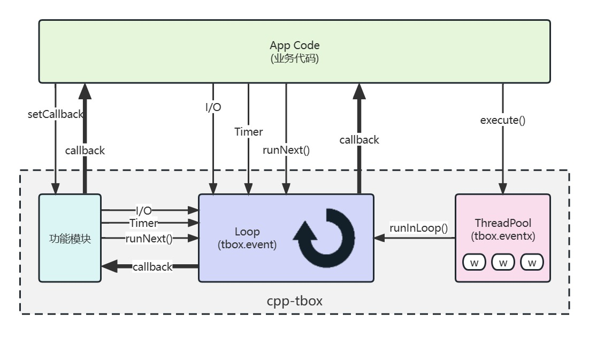  
This mode avoids the annoyance of competing locking in multi-thread mode, and the program is stable and reliable.  

## 2. Contains main framework, easy to use
All non-business-related work is handled using the built-in main framework. You don't need to care about such trivial things as how to output the log, how to parse the parameters, how to exit the program, and how to write the main function. The main frame is all handled for you.  
You only need to derive the `tbox::main::Module` class, fill in the business code, and then register to the framework.  
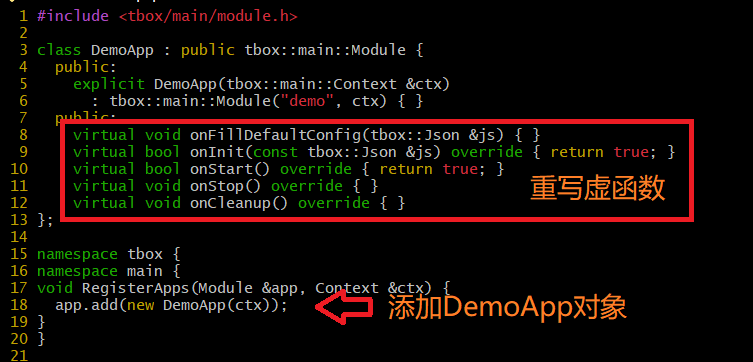  

## 3. With Shell-like terminal
You can interact with the running service through telnet, make it print internal data, or perform specific actions. This greatly reduces the difficulty of debugging.    
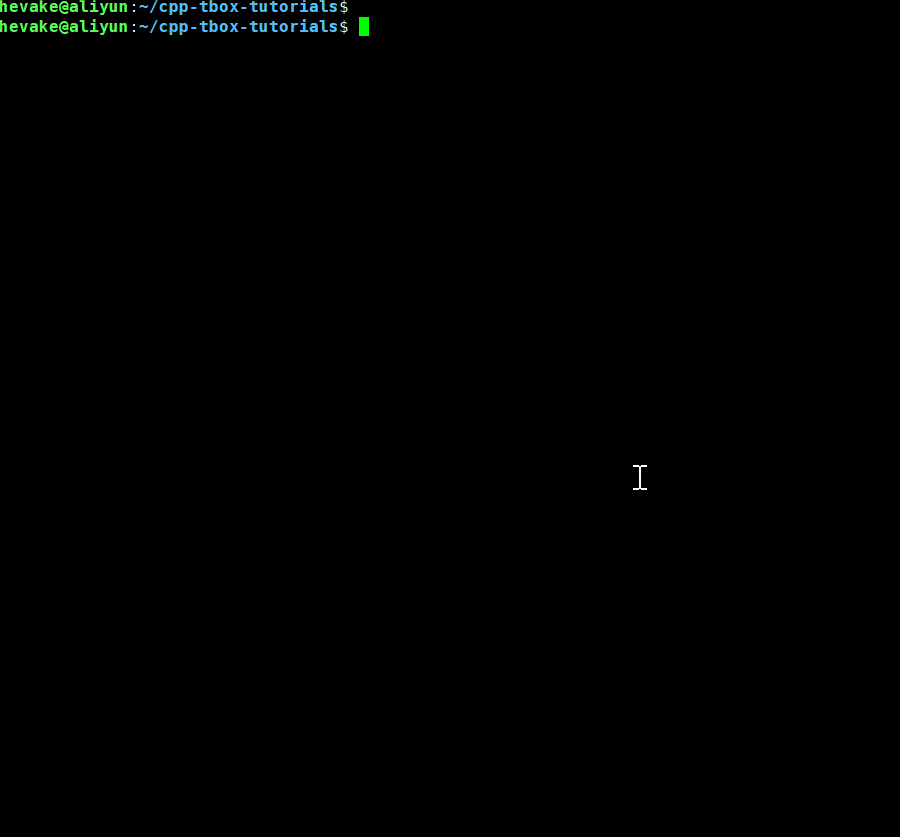  

## 4. With completely log system
**1) There are three log sink: stdout + filelog + syslog**  

- stdout，Output the log to the terminal via `std::cout`;
- syslog，Output logs to syslog via `syslog()`;
- filelog，Write the log to the specified directory, in the format: `<PRIFIX>.YYMMDD_HHMMSS.<PID>.log`. If the file size exceeds 1M, a new log file will be created. Due to the low efficiency of writing files, the output channel adopts the front-end and back-end modes.

One or more of the three sink can be selected in the startup parameters, and can also be changed through the terminal during operation.

**2) Different level different color**  
The log content includes: level, time (accurate to microseconds), thread number, module name, function name, text, file name, line number.  
It is convenient and quick to locate the problem. 
  

**3) Flexible log output filter**  
The log level can be set separately for different modules when the program is running, as follows:  
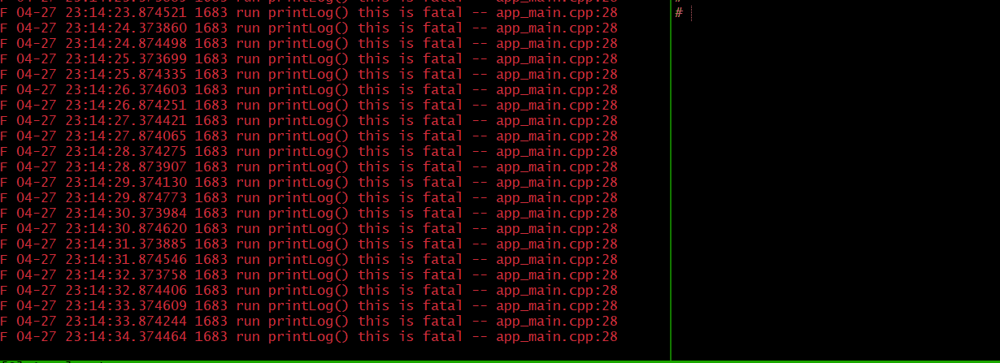  

## 5. Flexible parameter system
Parameters are provided in JSON format, and any format of running parameters can be passed in, including: integers, decimals, strings, arrays, and combination parameters, meeting almost all parameter passing requirements:  
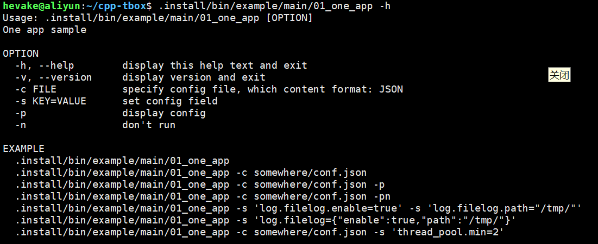  
You can use `-c your_cfg_file.json` to import a configuration file in JSON format at execution time. At the same time, you can also use `-s 'xx.yy.zz=vvv'` to specify parameters temporarily.  
The configuration file in JSON format also supports the include command to include other configuration files when loading.  

## 6. Assign tasks across threads without locking
The child thread entrusts the main thread to execute:  
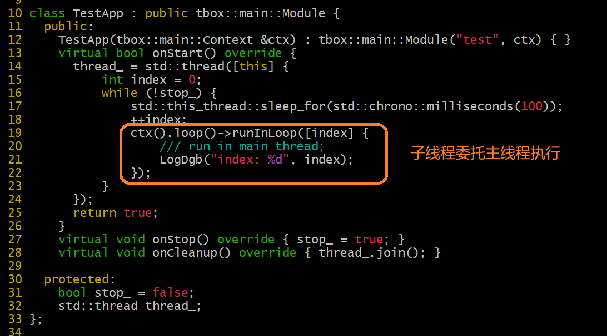  
The main thread entrusts the child thread to execute:  
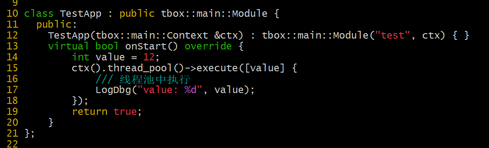  

## 7. Graceful exit process
When receiving signals: SIGINT, SIGTERM, SIGQUIT, SIGPWR, it will execute the exit process in an orderly manner and release resources. Do a clean exit.  
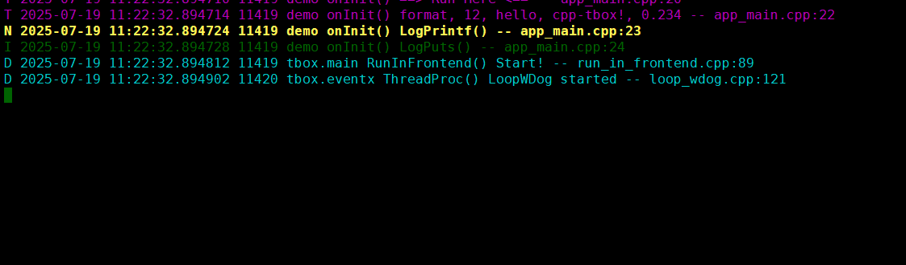  

## 8. Comprehensive exception capture mechanism
When various program exceptions occur in the program, such as: segment fault, assertion, bus error, exception not caught, etc., the framework will capture and print the complete call stack in the log system. Facing program crashes, no longer look blank. The effect is as follows:  
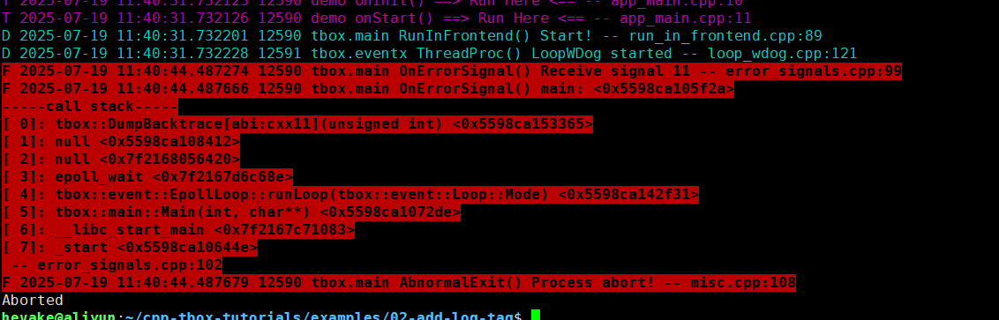  

## 9. Visualized trace module
The trace module can record the time and duration of each execution of the marked function, and can export the flame graph for display:  
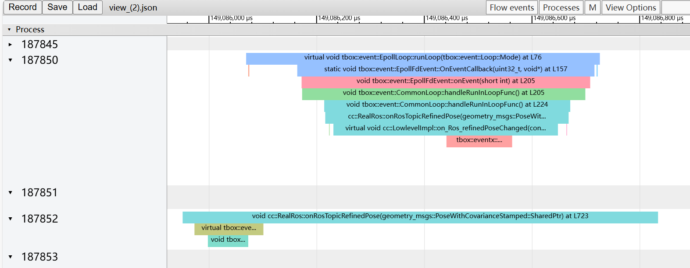  
It is a great tool for performance analysis and event blocking problem troubleshooting. 

## 10. Simple and visualized state machine
It abandons the cumbersome inheritance and derivation of the traditional state mode, and uses it directly in a combined way, which is simple and convenient. It can also export the state machine diagram to achieve what you see is what you get:  
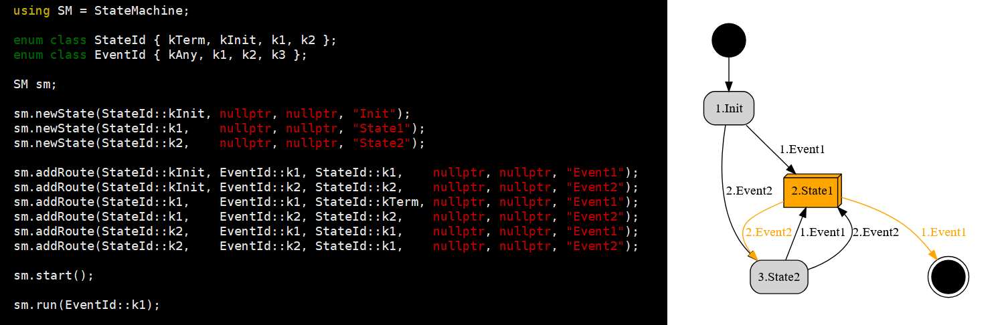  

## 11. Visualized behavior tree
It contains an event-driven behavior tree that can realize sequential, branching, and cyclic action processes in an asynchronous environment, and can export a visual tree diagram in real time:  
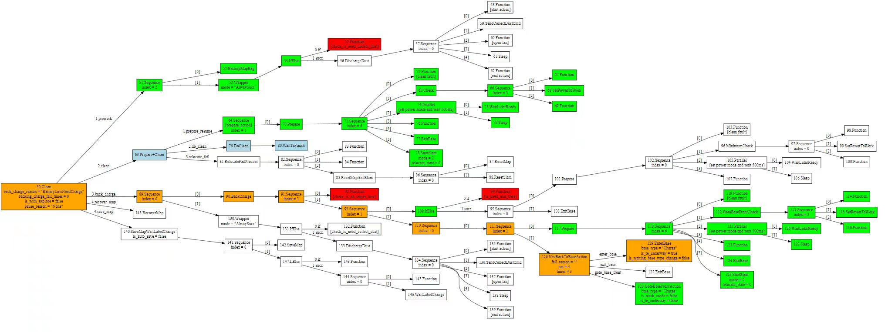  

## 12. Rich components

| Name | What |
|:----:|:----|
| base | Including log printing, common tools, etc. |
| util | Accessibility module |
| event | Realized IO, Timer, Signal three kinds of event-driven, which is the heart of the whole framework |
| eventx | Including ThreadPool thread pool, WorkThread worker thread, TimerPool timer pool and other modules |
| log | Realized efficient and reliable terminal, syslog, and log output in the form of files |
| trace | Realized outputting traces to files in real time |
| network | Realized serial port, terminal, UDP, TCP communication module |
| terminal | A shell-like command terminal that enables command interaction with programs during runtime |
| **main** | Realized a complete program startup process and framework, so that developers only need to care about business code |
| run | It's an ELF. It loads one or more lib\*.so file which specified by parameter `-l xxx`, then run Modules in side |
| mqtt | MQTT Client |
| coroutine | coroutine function |
| http | Implemented HTTP Server and Client modules on the basis of network |
| alarm | Realized 4 commonly used alarm clocks: CRON alarm clock, single alarm clock, weekly cycle alarm clock, weekday alarm clock |
| flow | Contains multi-level state machine and behavior tree to solve the problem of action flow in asynchronous mode |
| crypto | Implemented the commonly used AES and MD5 encryption and decryption calculations |
| dbus | Implemented the function of integrating dbus into event to process transactions in a non-blocking manner |

# Environment

- Linux series operating system;
- C++11 or above.

# Download & build

## Prepare
```
sudo apt update
sudo apt install build-essential
sudo apt install libgtest-dev libgmock-dev
sudo apt install libmosquitto-dev
sudo apt install libdbus-1-dev

git clone https://gitee.com/cpp-master/cpp-tbox.git
cd cpp-tbox
```

## Using GNU Make
```
make 3rd-party modules RELEASE=1
```
After completion, the header files and library files are in the .staging directory.  
Of course, you can also specify the generation path of header files and library files by specifying `STAGING_DIR`.  
like:  
```
make 3rd-party modules RELEASE=1 STAGING_DIR=$HOME/.tbox
```
After completion, the header files and library files are in the $HOME/.tbox path.  

## Using CMake
```
cmake -B build
cmake --build build
cmake --install build
```
Customize the installation directory by specifying `CMAKE_INSTALL_PREFIX` (installed in /usr/local by default):  
```
cmake -B build -DCMAKE_INSTALL_PREFIX=$HOME/.tbox
```

# Tutorial
For details on how to use cpp-tbox to develop your own programs, see the tutorial:  
[cpp-tbox-tutorials](https://github.com/cpp-main/cpp-tbox-tutorials/blob/master/README.md)  

For example to use `find_package`:
```
cmake_minimum_required(VERSION 3.10)
project(tbox-find_package)
find_package(tbox COMPONENTS base util alarm event eventx)
add_executable(demo main.cpp)
target_link_libraries(demo PRIVATE tbox::tbox_base tbox::tbox_util tbox::tbox_alarm tbox::tbox_event tbox::tbox_eventx)
```

# Dependencies

| Name | Dependent module | Required | Use | Install |
|:----:|:--------:|:--:|:----:|:--------:|
| libgtest-dev | all | no | unit testing | sudo apt install libgtest-dev |
| libgmock-dev | all | no |unit testing | sudo apt install libgmock-dev |
| libmosquitto-dev | mqtt | no | MQTT | sudo apt install libmosquitto-dev |
| libdbus-1-dev | dbus | no | DBus | sudo apt install libdbus-1-dev |

# Configure

Open the config.mk file, you don’t need to block the modules corresponding to `app_y += xxx`, but pay attention to the dependencies between modules.

# License

[MIT](LICENSE), Free for use.

# Feedback

- Issue: Any questions are welcome to communicate in issue
- WeChat: hevake\_lee (Note: cpp-tbox)
- QQ Group: 738084942 (cpp-tbox 技术交流)

# Encourage us

If this project makes your work easier and you leave work earlier, please give me more encouragement.
You can do these:  

- Light up three combos for it: Star, Watch, Fork;
- Recommend to colleagues and partners around you, and recommend to your readers in technical forums;
- Join the above QQ group, add me on WeChat to enter the WeChat group;
- Positive feedback on issues and suggestions;
- Participate in the development of the project and contribute your strength;
- Let me know which projects it is used in;
