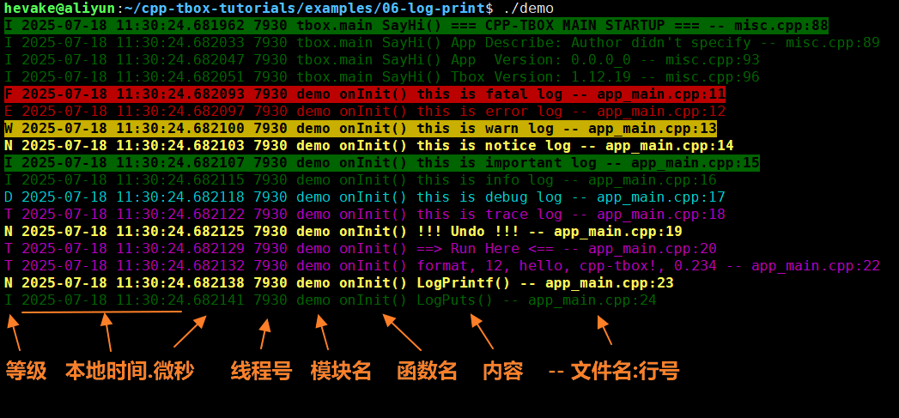

# 简介
cpp-tbox,全称: C++ Treasure Box,C++百宝箱,是一个基于事件驱动的服务型应用 **开发框架** 与 **组件库**。

# 特点

## 1. 基于Reactor模型
参考 Node.js 的 Reactor 模式。主线程跑 Reactor 处理非阻塞 IO,但配合 ThreadPool 解决大运算与阻塞性操作,避免了多线程模式竞态加锁的烦恼,令程序稳定可靠。

## 3. 具有类Shell的命令终端
可以与运行中的服务通过telnet进行交互,令其打印内部数据,或是执行特定的动作。极大地降低了调试难度。

## 4. 完备的日志系统
### 1)有三种日志输出渠道:终端 + 文件 + syslog

### 2)根据日志等级显示不同颜色,一目了然,内容详尽

日志内容包含了:等级、时间(精确到微秒)、线程号、模块名、函数名、正文、文件名、行号。
方便快速定位问题。

### 3)灵活的日志输出过滤器,可运行时修改
可针对不同的模块单独设置日志等级。

## 5. 灵活的参数系统,以不变应万变

## 6. 支持线程池、主次线程间无锁传递

## 7. 支持优雅的退出流程

## 8. 有异常打印机制

## 9. 有丰富的开发组件

# 应用场景

- 智能硬件(如:机器人、智能家居、机顶盒、无人机、车载等);
- 边缘计算组件;
- 后台服务型软件;

# 适用环境

- Linux 操作系统;
- C++11 以上。

# 安装与构建
[安装与构建教程](documents/00.install.md)

# 快速上手
[快速上手教程](documents/01.quick_start.md)

# 模块介绍

- base,基础库,含日志打印、常用工具等;
- util,工具库,在业务代码中可能会用到的库;
- event,事件库,实现Fd,Timer,Signal三种事件驱动;
- log,日志输出库,实现了终端、syslog、文件形式的日志输出;
- eventx,事件扩展库,含 ThreadPool 线程池模块,专用于处理阻塞性事务;TimerPool 定时器池模块;
- network,网络库,实现了串口、终端、UDP、TCP 通信模块;
- http,HTTP库,在network的基础上实现了HTTP的Server与Client模块;
- coroutine,协程库,众所周知,异步框架不方便处理顺序性业务,协程弥补之;
- mqtt,MQTT客户端库;
- terminal, 终端,类似shell的命令终端,可实现运行时与程序进行命令交互;
- main,应用程序框架,实现了完备的程序启动流程与框架,让开发者只需关心业务代码;
- alarm,闹钟模块,实现了4种常用的闹钟:CRON闹钟、单次闹钟、星期循环闹钟、工作日闹钟;
- flow,流程模块,含多层级状态机与行为树,解决异步模式下动行流程问题;

# 外部库依赖

| 库名 | 依赖模块 | 说明 | 安装方法 |
|:----:|:--------:|:----:|:--------:|
| libgtest-dev | 所有模块 | 单元测试用,如果不进行单元测试可忽略 | sudo apt install libgtest-dev |
| libgmock-dev | 所有模块 | 单元测试用,如果不进行单元测试可忽略 | sudo apt install libgmock-dev |
| mosquitto | mqtt | MQTT库,如果不使用mqtt模块可忽略 | sudo apt install libmosquitto-dev |

# 模块间依赖

# 模块裁减

打开 config.mk 文件,将不需要模块对应 `app_y += xxx` 屏蔽即可,但要注意模块间的依赖性。

# 开源许可

[MIT](LICENSE),可免费商用。

# 反馈途径

- Issue:任何问题都欢迎在issue里交流
- 微信:hevake_lee
- QQ群:738084942(cpp-tbox 技术交流)