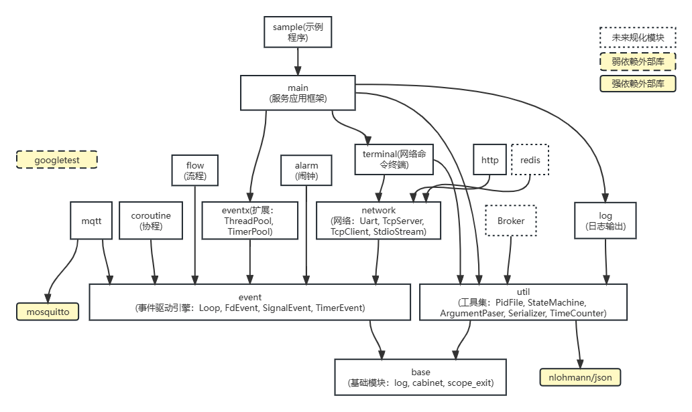
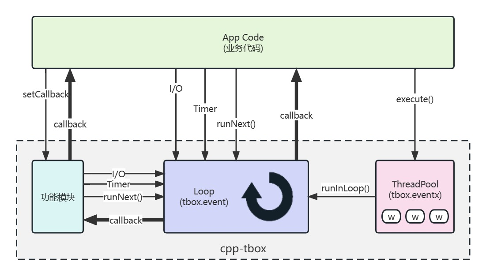
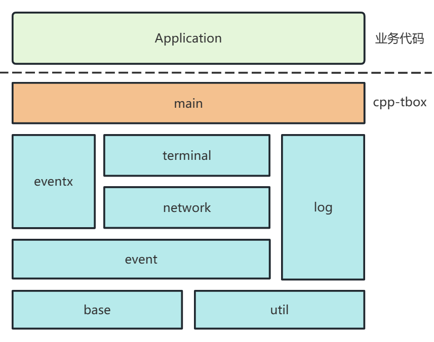
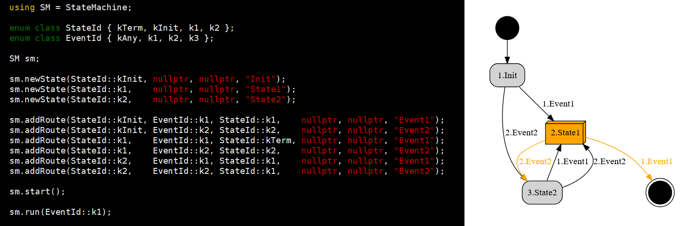
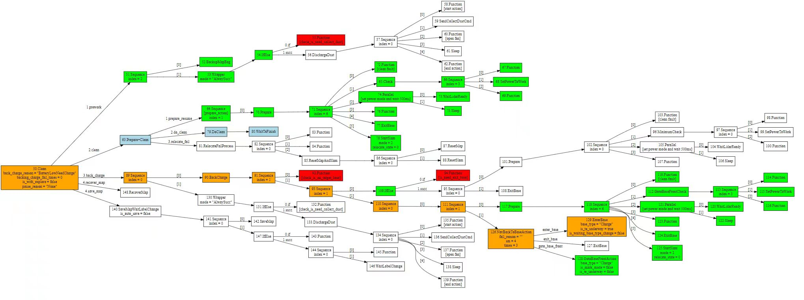
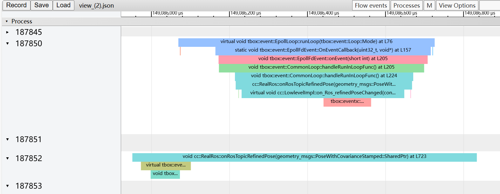

# cpp-tbox Module Documentation

cpp-tbox is an event-driven C++ service application development library that provides a complete service program development framework.

## Module Dependencies



## Module List

| Module | Description | Brief | Docs Link |
|--------|-------------|-------|-----------|
| **event** | Event-driven | Event loop and IO/timer/signal events | [event.md](event.md) |
| **base** | Base components | Log macros, assertions, object pool, lifetime tags, etc. | [base.md](base.md) |
| **main** | Application framework | Program startup framework, Module lifecycle management | [main.md](main.md) |
| **eventx** | Event extensions | Thread pool, timer pool, LoopThread, async operations | [eventx.md](eventx.md) |
| **network** | Network communication | TCP/UDP/UART communication and byte stream abstraction | [network.md](network.md) |
| **terminal** | Interactive terminal | Runtime command interaction, similar to Bash shell | [terminal.md](terminal.md) |
| **log** | Log channels | File/stdout/syslog and other log outputs | [log.md](log.md) |
| **http** | HTTP service | Express-style HTTP server/client and middleware | [http.md](http.md) |
| **websocket** | WebSocket service | WebSocket server/client, RFC 6455, HTTP middleware-based | [websocket.md](websocket.md) |
| **coroutine** | Coroutine | Coroutine scheduler and Channel/Mutex helper components | [coroutine.md](coroutine.md) |
| **alarm** | Timer alarm | Cron/Oneshot/Weekly/Workday timers | [alarm.md](alarm.md) |
| **util** | Utilities | Buffer/Json/serialization/UUID/Base64 and 17+ tools | [util.md](util.md) |
| **mqtt** | MQTT client | MQTT protocol client with TLS and auto-reconnect | [mqtt.md](mqtt.md) |
| **flow** | Flow control | Multi-level state machine and behavior tree | [flow.md](flow.md) |
| **jsonrpc** | JSON-RPC | JSON-RPC 2.0 protocol implementation | [jsonrpc.md](jsonrpc.md) |
| **trace** | Performance tracing | Function-level performance tracing and binary recording | [trace.md](trace.md) |
| **crypto** | Encryption | MD5 message digest and AES encryption/decryption | [crypto.md](crypto.md) |
| **dbus** | D-Bus integration | D-Bus bus and event loop integration | [dbus.md](dbus.md) |
| **run** | Module runner | Dynamically load business module .so and run | [run.md](run.md) |

## Quick Start

### The Simplest Program

```cpp
// app.cpp
#include <tbox/main/main.h>
#include <tbox/base/log.h>

class App : public tbox::main::Module {
  public:
    App(tbox::main::Context &ctx) : Module("app", ctx) { }
    bool onStart() override { LogInfo("started"); return true; }
    void onStop() override { LogInfo("stopped"); }
};

namespace tbox { namespace main {
void RegisterApps(Module &apps, Context &ctx) { apps.add(new ::App(ctx)); }
std::string GetAppDescribe() { return "my first tbox app"; }
std::string GetAppBuildTime() { return __DATE__ " " __TIME__; }
void GetAppVersion(int &major, int &minor, int &rev, int &build) { major = 0; minor = 1; rev = 0; build = 0; }
}}
```

### Compile and Run

```bash
# Compile
g++ -o myapp app.cpp -ltbox_main -ltbox_terminal -ltbox_network \
    -ltbox_eventx -ltbox_event -ltbox_util -ltbox_base -lpthread -ldl

# Run
./myapp          # Run in foreground, press Ctrl+C to exit
./myapp -d       # Run in background
./myapp -h       # Show help
./myapp -v       # Show version
```

### Core Concepts

1. **Event Loop (event::Loop)**: The scheduling center for all asynchronous events
2. **Module (main::Module)**: The carrier of business logic, following the initialize -> start -> stop -> cleanup lifecycle
3. **Callback-driven**: All asynchronous operations notify results through callback functions
4. **Single-thread model**: The event loop processes all event callbacks in a single thread; cross-thread operations are injected via runInLoop()

### Recommended Learning Order

1. [base](base.md) — Learn about logging, ScopeExit and other fundamentals
2. [event](event.md) — Understand the event loop mechanism
3. [main](main.md) — Master the program framework and Module lifecycle
4. Choose other modules based on business needs

## Common Patterns

### Initialize -> Start -> Stop -> Cleanup

Almost all tbox components follow the same lifecycle pattern:

```cpp
Component comp(loop);
comp.initialize(config);   //! Initialize configuration
comp.setCallback([] { ... });  //! Set callback
comp.start();  // or comp.enable()  //! Start/enable
// ... running normally ...
comp.stop();   // or comp.disable() //! Stop/disable
comp.cleanup();                //! Cleanup resources
```

### SetScopeExitAction Resource Management

```cpp
auto ptr = new SomeObject;
SetScopeExitAction([ptr] { delete ptr; });  //! Automatically release on scope exit
```

### Cross-thread Task Injection

```cpp
// Inject task into Loop from other threads
sp_loop->runInLoop([] { LogInfo("task in loop thread"); });

// Automatically choose route when thread is uncertain
sp_loop->run([] { LogInfo("auto route task"); });
```

## Reference Images

| Image | Description |
|-------|-------------|
|  | Event loop working principle |
|  | main module framework structure |
|  | Module dependency graph |
|  | State machine example |
|  | Behavior tree example |
|  | Performance tracing visualization |
