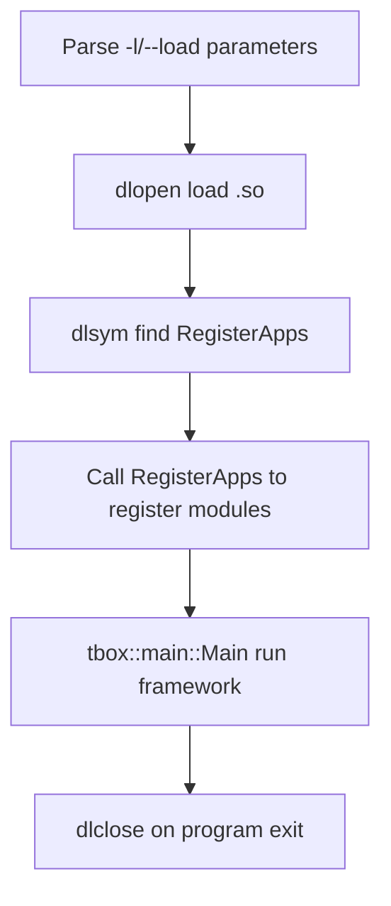

# Module Runner (run)

## What Is It?

The run module is a dynamic loader that loads and runs business modules compiled as shared libraries (.so). Business modules only need to export the `RegisterApps` symbol, and the run program specifies which module shared libraries to load via the `-l` or `--load` parameter.

## Why Do You Need It?

The run module separates business modules from the startup framework. Business modules are independently compiled into .so files and dynamically loaded and combined through the run program. This allows:
- Different business modules can be independently compiled and deployed
- No need to write a separate main function for each business scenario
- Flexibly combine multiple modules to run together

## Header File

The run module itself does not need a header file; it is a startup program implemented in `main.cpp`. Business modules use the header files from the main module.

```cpp
//! Business modules need:
#include <tbox/main/main.h>
#include <tbox/main/module.h>
#include <tbox/main/context.h>
```

## Core Mechanism

### Running Method

```bash
# Load a single module
./tbox_run -l echo_server.so

# Load multiple modules
./tbox_run -l echo_server.so -l nc_client.so

# Specify module path
./tbox_run --load /path/to/module.so

# Show help
./tbox_run -h

# Show version
./tbox_run -v
```

### Business Module Export Requirements

Business .so files need to export the following symbols (consistent with the RegisterApps mechanism of the main module):

```cpp
//! Must-export symbol
extern "C"
void RegisterApps(tbox::main::Module &apps, tbox::main::Context &ctx) {
    apps.add(new MyModule(ctx));
}

//! Optional export symbols
std::string GetAppDescribe() { return "echo server module"; }
std::string GetAppBuildTime() { return __DATE__ " " __TIME__; }
void GetAppVersion(int &major, int &minor, int &rev, int &build) {
    major = 0; minor = 0; rev = 1; build = 0;
}
```

> **Important**: RegisterApps must be exported using `extern "C"`, otherwise dlsym will not be able to find the symbol.

### Workflow



## Usage Example

### Writing a Business Module

> Complete example at `examples/run/echo_server/`

```cpp
// echo_server.cpp
#include "echo_server.h"
#include <tbox/base/log.h>

namespace echo_server {

App::App(Context &ctx) :
    Module("echo_server", ctx),
    server_(new TcpServer(ctx.loop()))
{ }

App::~App() { CHECK_DELETE_RESET_OBJ(server_); }

void App::onFillDefaultConfig(Json &cfg) const {
    cfg["bind"] = "127.0.0.1:12345";
}

bool App::onInit(const tbox::Json &cfg) {
    auto js_bind = cfg["bind"];
    if (!js_bind.is_string()) return false;
    if (!server_->initialize(SockAddr::FromString(js_bind.get<std::string>()), 2))
        return false;
    server_->setReceiveCallback(
        [this] (const TcpServer::ConnToken &client, Buffer &buff) {
            server_->send(client, buff.readableBegin(), buff.readableSize());
            buff.hasReadAll();
        }, 0
    );
    return true;
}

bool App::onStart() { return server_->start(); }
void App::onStop() { server_->stop(); }
void App::onCleanup() { server_->cleanup(); }

}

//! Export RegisterApps symbol
extern "C"
void RegisterApps(tbox::main::Module &apps, tbox::main::Context &ctx) {
    apps.add(new echo_server::App(ctx));
}
```

### Compiling as a Shared Library

```makefile
# Makefile example
CXXFLAGS += -fPIC -shared  # Compile as shared library
LDFLAGS += -ltbox_network -ltbox_eventx -ltbox_event -ltbox_util -ltbox_base
```

### Running

```bash
# Compile
make

# Run
./tbox_run -l echo_server.so
```

### Other Examples

- `examples/run/nc_client/` — Command-line TCP client module
- `examples/run/timer_event/` — Timer event module

## Common Scenarios

1. **Modular Deployment**: Different business modules are independently compiled into .so files and loaded on demand
2. **Dynamic Extension**: Add new modules at runtime via `-l` parameter without recompiling the main program
3. **Independent Development**: Each module team develops independently, without depending on the main program code
4. **Test Execution**: Load test modules to verify functionality

## Notes

1. **extern "C" Export**: RegisterApps must be exported using `extern "C"`, otherwise dlsym cannot find the C++ mangled symbol name
2. **.so Compilation Options**: Must add `-fPIC -shared` compilation options
3. **Library Dependencies**: The .so module needs to link the tbox libraries it depends on (network/eventx/event/util/base etc.)
4. **Load Failure Handling**: The run program prints a warning on load failure but does not terminate; it continues to attempt loading other modules
5. **Module Unloading**: All loaded .so files are automatically dlclosed when the program exits

## Related Modules

- **main**: run uses the Main() function of the main module to run the framework; business modules use the Module base class
- **util**: Uses ArgumentParser to parse -l/--load parameters
- **network**: Common business modules use TcpServer/TcpClient and other network components
- **base**: Provides Log, Json and other infrastructure
