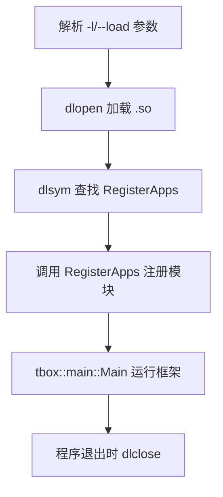

# 模块运行器 (run)

## 是什么？

run 模块是一个动态加载器，它将编译为动态库（.so）的业务模块加载并运行。业务模块只需导出 `RegisterApps` 符号，run 程序通过 `-l` 或 `--load` 参数指定要加载的模块动态库。

## 为什么需要它？

run 模块让业务模块与启动框架分离。业务模块独立编译为 .so 文件，通过 run 程序动态加载组合。这样：
- 不同业务模块可以独立编译和部署
- 不需要为每个业务场景编写独立的 main 函数
- 可以灵活组合多个模块运行

## 头文件

run 模块本身不需要头文件，它是 `main.cpp` 实现的启动程序。业务模块使用 main 模块的头文件。

```cpp
//! 业务模块需要：
#include <tbox/main/main.h>
#include <tbox/main/module.h>
#include <tbox/main/context.h>
```

## 核心机制

### 运行方式

```bash
# 加载单个模块
./tbox_run -l echo_server.so

# 加载多个模块
./tbox_run -l echo_server.so -l nc_client.so

# 指定模块路径
./tbox_run --load /path/to/module.so

# 查看帮助
./tbox_run -h

# 查看版本
./tbox_run -v
```

### 业务模块导出要求

业务 .so 文件需要导出以下符号（与 main 模块的 RegisterApps 机制一致）：

```cpp
//! 必须导出的符号
extern "C"
void RegisterApps(tbox::main::Module &apps, tbox::main::Context &ctx) {
    apps.add(new MyModule(ctx));
}

//!可选导出的符号
std::string GetAppDescribe() { return "echo server module"; }
std::string GetAppBuildTime() { return __DATE__ " " __TIME__; }
void GetAppVersion(int &major, int &minor, int &rev, int &build) {
    major = 0; minor = 0; rev = 1; build = 0;
}
```

> **重要**：RegisterApps 必须使用 `extern "C"` 导出，否则 dlsym 无法找到符号。

### 工作流程



## 使用示例

### 编写业务模块

> 完整示例见 `examples/run/echo_server/`

```cpp
// echo_server.cpp
#include "echo_server.h"
#include <tbox/base/log.h>

namespace echo_server {

App::App(Context &ctx) :
    Module("echo_server", ctx),
    server_(new TcpServer(ctx.loop()))
{ }

App::~App() { CHECK_DELETE_RESET_OBJ(server_); }

void App::onFillDefaultConfig(Json &cfg) const {
    cfg["bind"] = "127.0.0.1:12345";
}

bool App::onInit(const tbox::Json &cfg) {
    auto js_bind = cfg["bind"];
    if (!js_bind.is_string()) return false;
    if (!server_->initialize(SockAddr::FromString(js_bind.get<std::string>()), 2))
        return false;
    server_->setReceiveCallback(
        [this] (const TcpServer::ConnToken &client, Buffer &buff) {
            server_->send(client, buff.readableBegin(), buff.readableSize());
            buff.hasReadAll();
        }, 0
    );
    return true;
}

bool App::onStart() { return server_->start(); }
void App::onStop() { server_->stop(); }
void App::onCleanup() { server_->cleanup(); }

}

//! 导出 RegisterApps 符号
extern "C"
void RegisterApps(tbox::main::Module &apps, tbox::main::Context &ctx) {
    apps.add(new echo_server::App(ctx));
}
```

### 编译为动态库

```makefile
# Makefile 示例
CXXFLAGS += -fPIC -shared  # 编译为共享库
LDFLAGS += -ltbox_network -ltbox_eventx -ltbox_event -ltbox_util -ltbox_base
```

### 运行

```bash
# 编译
make

# 运行
./tbox_run -l echo_server.so
```

### 其他示例

- `examples/run/nc_client/` — 命令行 TCP 客户端模块
- `examples/run/timer_event/` — 定时器事件模块

## 常见场景

1. **模块化部署**：不同业务模块独立编译为 .so，按需加载组合
2. **动态扩展**：运行时通过 `-l` 参数添加新模块，无需重新编译主程序
3. **独立开发**：各模块团队独立开发，互不依赖主程序代码
4. **测试运行**：加载测试模块验证功能

## 注意事项

1. **extern "C" 导出**：RegisterApps 必须使用 `extern "C"` 导出，否则 dlsym 找不到 C++ 编译后的符号名
2. **.so 编译选项**：需添加 `-fPIC -shared` 编译选项
3. **库依赖**：.so 模块需要链接它所依赖的 tbox 库（network/eventx/event/util/base 等）
4. **加载失败处理**：run 程序对加载失败打印警告但不终止，继续尝试加载其他模块
5. **模块卸载**：程序退出时自动 dlclose 所有已加载的 .so

## 相关模块

- **main**：run 使用 main 模块的 Main() 函数运行框架，业务模块使用 Module 基类
- **util**：使用 ArgumentParser 解析 -l/--load 参数
- **network**：常见业务模块使用 TcpServer/TcpClient 等网络组件
- **base**：提供 Log、Json 等基础设施
